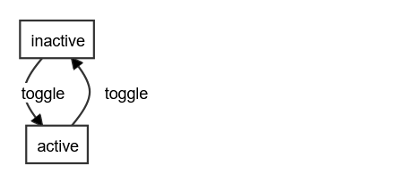
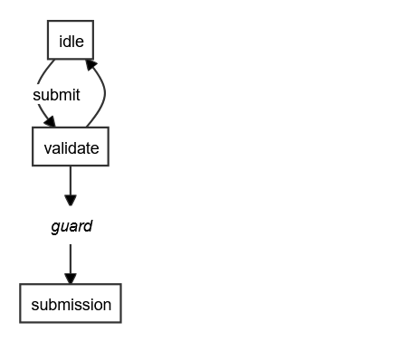
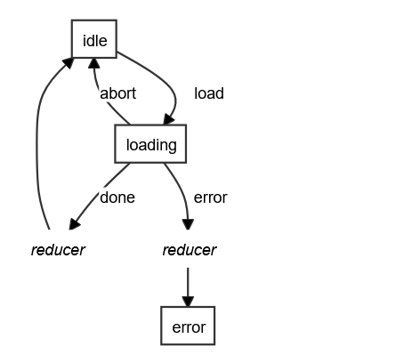

# robot3-viz

- 🎨 Visualise [Robot3](https://thisrobot.life/) finite state machines
- 👀 See a flowchart representation of your state
- 🖼 Generate SVGs from your state machine code
- ⚛ React component included
- 💡 Uses [Dagre](https://github.com/dagrejs/dagre) and
  [D3](https://d3js.org/) under the hood
- 🌍 Provided on a AGPL-3.0 license

You can use this library to create in-browser visualisations of the state 
machines that power your JavaScript apps.

If you need to generate static SVGs as part of a CI process, you'll 
want to automate a browser running on a server with XVFB, and make it visit 
a page using this library.

## Contents

- [Installing]
- Usage
  - React
  - SVG
  - Non-DOM API
- Styling
- [Examples](#examples)
- [Licenses, etc.](#licenses-etc)

## Installing

```
npm install robot3-viz
yarn add robot3-viz
```


## Examples

A light switch:



An RPG monster. It changes state conditionally, using guard functions:


A web form - every submission validates, but only conditionally goes to 
`submission`



A login screen - `login` and `password` events write to state with reducers.


A loading screen, invoking a promise:



## Licenses etc.

Provided with a GNU Affero General Public License (AGPL 3.0). No warranty.

Copyright (C) 2021 Jimmy Breck-McKye