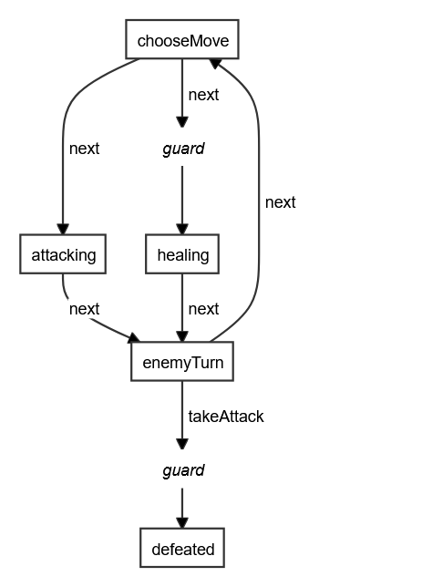
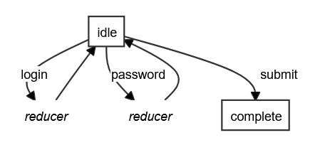

# robot3-viz

- 🎨 Visualise [Robot3](https://thisrobot.life/) finite state machines as SVGs
- ⚛ React component included
- ✅ Supports custom styling and renderer
- 💡 Uses [Dagre](https://github.com/dagrejs/dagre) and
  [D3](https://d3js.org/) under the hood

You can use this library to create in-browser visualisations of the state 
machines that power your JavaScript apps.

If you need to generate static SVGs as part of a CI process, you'll 
want to automate a browser running on a server with XVFB, and make it visit 
a page using this library.

## Contents

- [Installing](#installing)
- [Usage](#usage)
  - [React](#react)
  - [Vanilla JS / SVG](#vanilla-js--svg)
  - [Custom renderer](#custom-renderer)
- [Styling](#styling)
- [Examples](#examples)
- [Licenses, etc.](#licenses-etc)

## Installing

```
npm install robot3-viz
yarn add robot3-viz
```

## Usage

### React

```tsx
import { Robot3Viz } from 'robot3-viz';

const machine = createMachine({
  inactive: state(
    transition('toggle', 'active')
  ),
  active: state(
    transition('toggle', 'inactive')
  )
});

function Component() {
  // Return the SVG as part of a React DOM
  return (
    <Robot3Viz fsm={machine} />
  );
}
```

### Vanilla JS / SVG

```typescript
import { robot3viz } from 'robot3-viz';

const machine = createMachine({
  inactive: state(
    transition('toggle', 'active')
  ),
  active: state(
    transition('toggle', 'inactive')
  )
});

// Render the FSM in an existing SVG element
const svg = document.getElementById('mySVG');
robot3viz(machine, svg);
```

### Custom renderer

You don't have to use the inbuilt D3 renderer - you can use the library API 
to construct either the DAGre graph yourself, or the raw DAG for use in a 
another framework.

Consult the TypeScript .d.ts files for type information

```typescript
import { getDAG, getDagre } from 'robot3-viz';

// Construct the raw DAG
// This will be a struct containing a list of nodes and edges
const dag = getDAG(machine)

// Convert to DAGre format
// This can be passed to a DAGre renderer like Cytoscape
const dagre = getDagre(dag)
```

## Styling

The SVGs come with a set of default styling attributes, but these can be 
overriden using CSS. There are several classes:

| Class | Description |
| --- | --- |
| `robot3-viz` | Root class of SVG |
| `node` | Graph node |
| `node--state` | State |
| `node--guard` | Guard function |
| `node--reduce` | Reducer function |
| `edgePath` | Edge |
| `edge--event` | Transition caused by event |
| `edge--immediate` | Transition executed immediately |
| `edge--labelBkg` | Background of edge label |

You can also customise the DAGre render:

```tsx
// Possible values listed here: https://github.com/dagrejs/dagre/wiki#configuring-the-layout
const options: dagre.GraphLabel = {
  nodesep: 40,
  edgesep: 40,
  ranksep: 40
}

// Using vanilla JS
robot3viz(machine, svg, options)

// Using JSX
function Component() {
  return <Robot3Viz machine={machine} options={options} style={svgStyles} />
}
```

## Examples

### Simple states

A light switch:


```typescript
export const transitions = createMachine({
  inactive: state(
    transition('toggle', 'active')
  ),
  active: state(
    transition('toggle', 'inactive')
  )
});
```

### Guard functions

An RPG monster. It changes state conditionally, using guard functions:


```typescript
export const guards = createMachine({
  chooseMove: state(
    transition('next', 'healing', guard(function amHurt(ctx) { return true })),
    transition('next', 'attacking')
  ),
  attacking: state(
    transition('next', 'enemyTurn')
  ),
  healing: state(
    transition('next', 'enemyTurn')
  ),
  enemyTurn: state(
    transition('takeAttack', 'defeated', guard(function strongEnough (ctx) { return true })),
    transition('next', 'chooseMove')
  ),
  defeated: state()
});
```

### Immediate transitions

A web form - every submission validates, but only conditionally goes to 
`submission`


```typescript
export const immediates = createMachine({
  idle: state(
    transition('submit', 'validate')
  ),
  validate: state(
    immediate('submission', guard(function canSubmit() {} as any)),
    immediate('idle')
  ),
  submission: state()
});
```

### Reducer functions

A login screen - `login` and `password` events write to state with reducers.



```typescript
export const reducers = createMachine({
  idle: state(
    transition('login', 'idle',
      reduce((ctx: any, ev: any) => ({ ...ctx, login: ev.target.value }))
    ),
    transition('password', 'idle',
      reduce((ctx: any, ev: any) => ({ ...ctx, password: ev.target.value }))
    ),
    transition('submit', 'complete')
  ),
  complete: state()
});
```

### Machines invoking promises

A loading screen, invoking a promise:


```typescript
export const invokePromises = createMachine({
  idle: state(
    transition('load', 'loading')
  ),
  loading: invoke(async () => Promise.resolve(true),
    transition('done', 'idle',
      reduce((ctx: any, ev: any) => ({ ...ctx, user: ev.data }))
    ),
    transition('error', 'error',
      reduce((ctx: any, ev: any) => ({ ...ctx, error: ev.error }))
    ),
    transition('abort', 'idle')
  ),
  error: state()
})
```

## Licenses etc.

Provided with a GNU Affero General Public License (AGPL 3.0). No warranty.

Copyright (C) 2021 Jimmy Breck-McKye